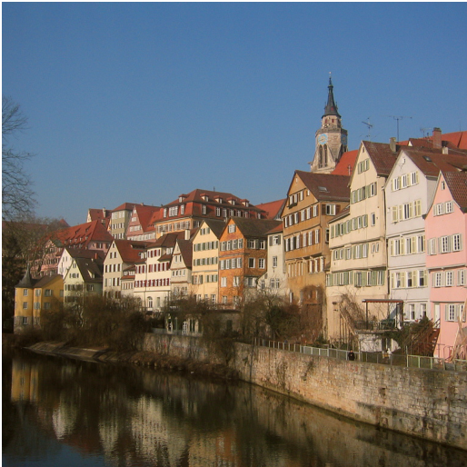
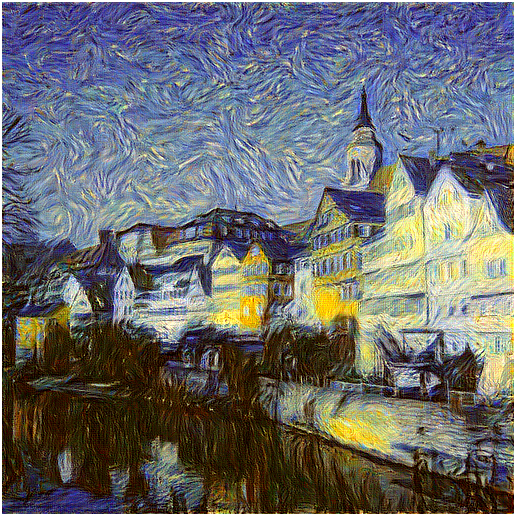
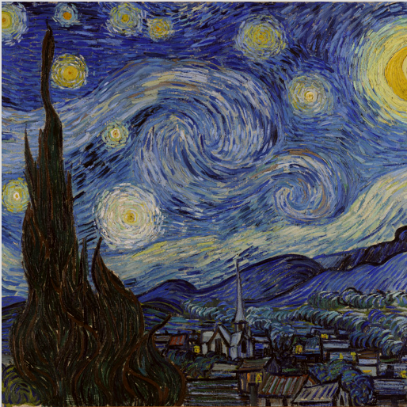
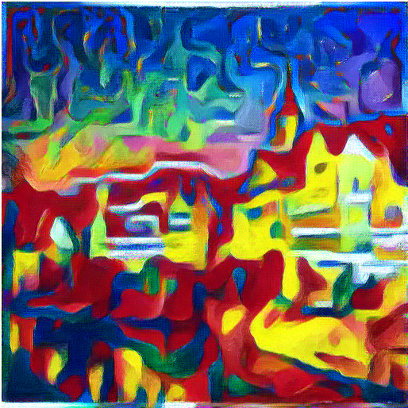
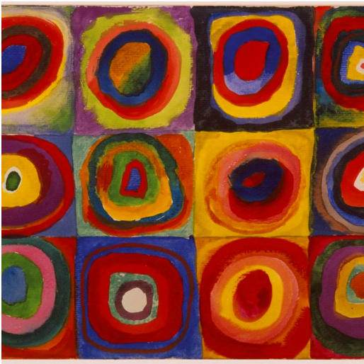
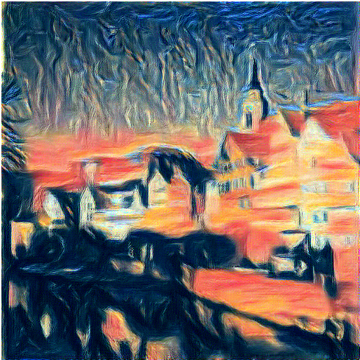
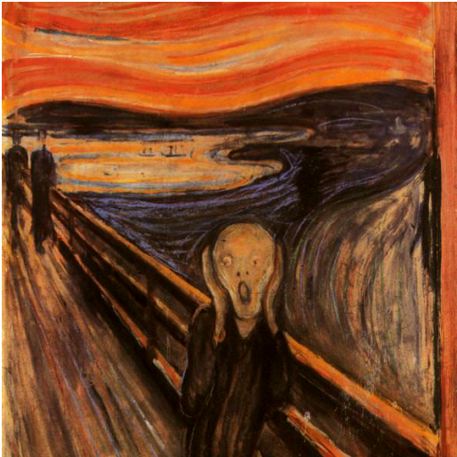
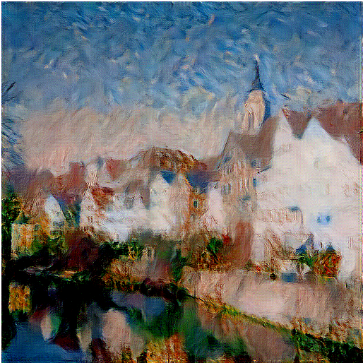
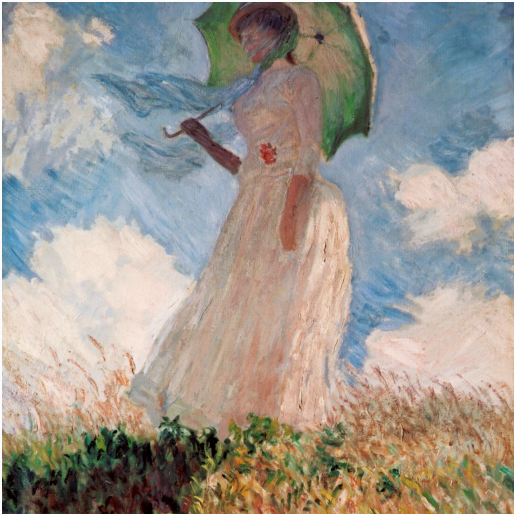

# Image Style Transfer

Paper -> [Image Style Transfer Using Convoultional Neural Networks](http://www.cv-foundation.org/openaccess/content_cvpr_2016/papers/Gatys_Image_Style_Transfer_CVPR_2016_paper.pdf)

 
 
 

