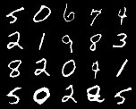

# InfoGAN

InfoGAN: Interpretable Representation Learning by Information Maximizing Generative Adversarial Nets(https://arxiv.org/pdf/1606.03657.pdf)

## Parameter Setting

Noise z: 62  
Discrete: 10  
Continuous: 2  
lambda: 0.75  

~~~
mkdir result_catcon
mkdir result_contin
mkdir model
