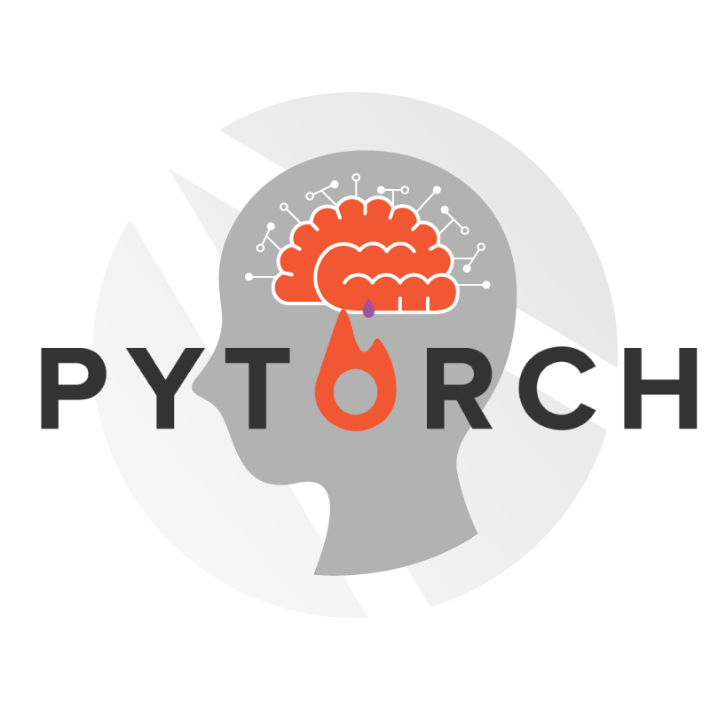

# PyTorch FastCampus

PyTorch로 시작하는 딥러닝 입문 CAMP (www.fastcampus.co.kr/data_camp_pytorch/) 1,2기 강의자료

Requirements
-------------------------
- python 3.6
- Pytorch (http://pytorch.org/)
- Numpy
- matplotlib

Optional
--------------------------
- visdom (https://github.com/facebookresearch/visdom)

설치방법 [PyTorch & Jupyter Notebook](https://github.com/GunhoChoi/PyTorch-FastCampus/blob/master/01_DL%26Pytorch/PyTorch_AWS%EC%84%A4%EC%B9%98.pdf)
-------------------------------------
- AWS p2.xlarge(Tesla K80 GPU)
- CUDA 8.0
- CuDNN 5.1
- Anaconda(https://mirrors.tuna.tsinghua.edu.cn/anaconda/archive/)
- PyTorch
- Jupyter Notebook

강의자료
--------------------------
## 1강 [Deep Learning & PyTorch](https://github.com/GunhoChoi/PyTorch-FastCampus/blob/master/01_DL%26Pytorch/%EB%94%A5%EB%9F%AC%EB%8B%9D%26%ED%8C%8C%EC%9D%B4%ED%86%A0%EC%B9%98.pdf)

1) [파이썬 기초](https://github.com/GunhoChoi/PyTorch-FastCampus/blob/master/01_DL%26Pytorch/0_Python_Tutorial.ipynb)

2) [프레임워크 비교](https://github.com/GunhoChoi/PyTorch-FastCampus/blob/master/01_DL%26Pytorch/1_Framework_Comparison.ipynb)

3) [파이토치 기본 사용법](https://github.com/GunhoChoi/PyTorch-FastCampus/blob/master/01_DL%26Pytorch/2_pytorch_tensor_basic.ipynb)

## 2강 [Linear Regression & Neural Network](https://github.com/GunhoChoi/PyTorch-FastCampus/blob/master/02_Regression%26NN/Regression%26NN.pdf)

1) [Automatic Gradient Calculation](https://github.com/GunhoChoi/PyTorch-FastCampus/blob/master/02_Regression%26NN/0_Linear_code/0_Variable_Autograd.ipynb)

2) [시각화 툴 Visdom 소개](https://github.com/GunhoChoi/PyTorch_FastCampus/blob/master/02_Regression%26NN/Visdom_Tutorial.ipynb)

3) [선형회귀모델](https://github.com/GunhoChoi/PyTorch_FastCampus/blob/master/02_Regression%26NN/0_Linear_code/1_linear_regression.ipynb)

4) [선형회귀모델의 한계](https://github.com/GunhoChoi/PyTorch_FastCampus/blob/master/02_Regression%26NN/0_Linear_code/2_linear_nonlinear.ipynb)

5) [인공신경망 모델 - 2차함수근사](https://github.com/GunhoChoi/PyTorch_FastCampus/blob/master/02_Regression%26NN/1_NN_code/1d_data/0_neural_quadratic.ipynb)

6) [인공신경망 모델 - 3차함수근사](https://github.com/GunhoChoi/PyTorch_FastCampus/blob/master/02_Regression%26NN/1_NN_code/1d_data/1_neural_cubic.ipynb)

7) [인공신경망 모델 - 2D데이터](https://github.com/GunhoChoi/PyTorch_FastCampus/blob/master/02_Regression%26NN/1_NN_code/2d_data/neural_2d.ipynb)

## 3강 [Convolutional Neural Network - Basic](https://github.com/GunhoChoi/PyTorch-FastCampus/blob/master/03_CNN_Basics/CNN_basic.pdf)

1) [CNN 기본 모듈](https://github.com/GunhoChoi/PyTorch_FastCampus/blob/master/03_CNN_Basics/0_MNIST/0_Basic_Modules.ipynb)

2) [NN으로 MNIST 풀어보기](https://github.com/GunhoChoi/PyTorch_FastCampus/blob/master/03_CNN_Basics/0_MNIST/1_Linear_mnist.ipynb)

3) [CNN으로 MNIST 풀어보기](https://github.com/GunhoChoi/PyTorch_FastCampus/blob/master/03_CNN_Basics/0_MNIST/3_CNN_clean.ipynb)

4) [CNN으로 CIFAR10 풀어보기](https://github.com/GunhoChoi/PyTorch_FastCampus/blob/master/03_CNN_Basics/1_CIFAR/CNN_CIFAR10.ipynb)

## 4강 [Convolutional Neural Network - Advanced](https://github.com/GunhoChoi/PyTorch_FastCampus/blob/master/04_CNN_Advanced/CNN_Advanced.pdf) 

1) [Custom Data 불러오기](https://github.com/GunhoChoi/PyTorch_FastCampus/blob/master/04_CNN_Advanced/0_Custom_DataLoader.ipynb)

2) [VGGNet 구현해보기](https://github.com/GunhoChoi/PyTorch_FastCampus/blob/master/04_CNN_Advanced/1_VGGNet.ipynb)

3) [GoogLeNet 구현해보기](https://github.com/GunhoChoi/PyTorch_FastCampus/blob/master/04_CNN_Advanced/2_GoogleNet.ipynb)

4) [ResNet 구현해보기](https://github.com/GunhoChoi/PyTorch_FastCampus/blob/master/04_CNN_Advanced/3_ResNet.ipynb)

## 5강 [Recurrent Neural Network - Basic](https://github.com/GunhoChoi/PyTorch_FastCampus/blob/master/05_RNN/RNN.pdf)

1) [RNN 직접 만들어보기](https://github.com/GunhoChoi/PyTorch_FastCampus/blob/master/05_RNN/0_Basic/Simple_Char_RNNcell.ipynb)

2) [LSTM 튜토리얼](https://github.com/GunhoChoi/PyTorch_FastCampus/blob/master/05_RNN/1_LSTM/0_LSTM_Practice.ipynb)

3) [LSTM으로 문장 기억하기](https://github.com/GunhoChoi/PyTorch_FastCampus/blob/master/05_RNN/1_LSTM/1_Char_LSTM.ipynb)

4) [nn.Embedding 사용법](https://github.com/GunhoChoi/PyTorch_FastCampus/blob/master/05_RNN/2_Char_RNN/0_Embedding_Practice.ipynb)

5) [Shakespeare 문체 모방하기-RNN](https://github.com/GunhoChoi/PyTorch_FastCampus/blob/master/05_RNN/2_Char_RNN/1_Char_RNN_Naive.ipynb)

6) [Shakespeare 문체 모방하기-GRU](https://github.com/GunhoChoi/PyTorch_FastCampus/blob/master/05_RNN/2_Char_RNN/2_Char_RNN_GRU.ipynb)

7) [Shakespeare 문체 모방하기-LSTM](https://github.com/GunhoChoi/PyTorch_FastCampus/blob/master/05_RNN/2_Char_RNN/3_Char_RNN_LSTM.ipynb)

## 6강 [Problem & Solutions](https://github.com/GunhoChoi/PyTorch_FastCampus/blob/master/06_Prob%26Solutions/Problem%26Solutions.pdf)

1) [Weight Regularization](https://github.com/GunhoChoi/PyTorch_FastCampus/blob/master/06_Prob%26Solutions/0_Weight_Regularization.ipynb)

2) [Dropout](https://github.com/GunhoChoi/PyTorch_FastCampus/blob/master/06_Prob%26Solutions/1_Dropout.ipynb)

3) [Data Augmentation](https://github.com/GunhoChoi/PyTorch_FastCampus/blob/master/06_Prob%26Solutions/2_Data_Augmentation.ipynb)

4) [Weight Initialization](https://github.com/GunhoChoi/PyTorch_FastCampus/blob/master/06_Prob%26Solutions/3_Weight_Initialization.ipynb)

5) [Learning Rate Scheduler](https://github.com/GunhoChoi/PyTorch_FastCampus/blob/master/06_Prob%26Solutions/4_Learning_Rate_Decay.ipynb)

6) [Data Normalization](https://github.com/GunhoChoi/PyTorch_FastCampus/blob/master/06_Prob%26Solutions/5_Data_Normalization.ipynb)

7) [Batch Normalization](https://github.com/GunhoChoi/PyTorch_FastCampus/blob/master/06_Prob%26Solutions/6_Batch_Normalization.ipynb)

8) [Gradient Descent Variants](https://github.com/GunhoChoi/PyTorch_FastCampus/blob/master/06_Prob%26Solutions/7_Gradient_Descent_Variants.ipynb)

## 7강 [Transfer Learning](https://github.com/GunhoChoi/PyTorch_FastCampus/blob/master/07_Transfer_Learning/Transfer_Learning.pdf)

1) [Transfer Learning Basic 학습된 모델에서 원하는 부분만 뽑아내고 학습시키기](https://github.com/GunhoChoi/PyTorch_FastCampus/blob/master/07_Transfer_Learning/0_Pretrained_Basic/Transfer_Learning.ipynb)

2) [Style Transfer 명화의 그림체 모방하기](https://github.com/GunhoChoi/PyTorch_FastCampus/blob/master/07_Transfer_Learning/1_StyleTransfer/StyleTransfer_LBFGS_gpu.ipynb)

3) [t-SNE Visualization 뽑아낸 스타일들이 어떻게 분포하는지 확인해보기](https://github.com/GunhoChoi/PyTorch_FastCampus/blob/master/07_Transfer_Learning/2_T-SNE/Style_TSNE.ipynb)

## 8강 [AutoEncoder & Transposed Convolution](https://github.com/GunhoChoi/PyTorch-FastCampus/blob/master/08_Autoencoder/%5B2%EA%B8%B0%5DAutoEncoder.pdf)

1) [Basic Autoencoder](https://github.com/GunhoChoi/PyTorch_FastCampus/blob/master/08_Autoencoder/0_Basic_Autoencoder.ipynb)

2) [Embedding Vector는 어떻게 분포하고 있을까? (돌아온 t-SNE)](https://github.com/GunhoChoi/PyTorch_FastCampus/blob/master/08_Autoencoder/5_Basic_Autoencoder_TSNE.ipynb)

3) [Convolutional Autoencoder (CNN + Autoencoder)](https://github.com/GunhoChoi/PyTorch_FastCampus/blob/master/08_Autoencoder/1_Convolutional_Autoencoder.ipynb)

4) [Convolutional Denoising Autoencoder (Noise + CNN + Autoencoder)](https://github.com/GunhoChoi/PyTorch_FastCampus/blob/master/08_Autoencoder/2_Convolutional_Denoising_Autoencoder.ipynb)

5) [Variational Autoencoder (latent vector z~N(0,I))](https://github.com/GunhoChoi/PyTorch_FastCampus/blob/master/08_Autoencoder/3_Variational_Autoencoder.ipynb)

6) [Convolutional Variational Autoencoder](https://github.com/GunhoChoi/PyTorch_FastCampus/blob/master/08_Autoencoder/4_Convolutional_Variational_Autoencoder.ipynb)

7) [Convolutional VAE Latent Space Interpolation](https://github.com/GunhoChoi/PyTorch-FastCampus/blob/master/08_Autoencoder/4-1_Convolutional_Variational_Autoencoder_Interpolation.ipynb)

## 9강 [Generative Adversarial Networks](https://github.com/GunhoChoi/PyTorch-FastCampus/blob/master/09_GAN/GAN(generative%20adversarial%20networks).pdf)

1) [Basic GAN using NN](https://github.com/GunhoChoi/PyTorch-FastCampus/tree/master/09_GAN/0_GAN)

2) [DCGAN (CNN + GAN)](https://github.com/GunhoChoi/PyTorch-FastCampus/tree/master/09_GAN/1_DCGAN)

3) [InfoGAN (Mutual Information Maximizing + GAN)](https://github.com/GunhoChoi/PyTorch-FastCampus/tree/master/09_GAN/2_InfoGAN)

## 10강 [Deep Learning Applications](https://github.com/GunhoChoi/PyTorch-FastCampus/blob/master/10_Applications/Deep%20Learning%20Applications.pdf)
